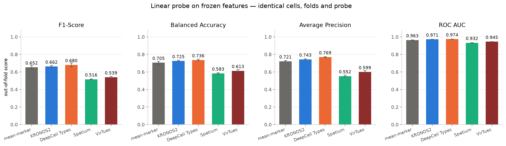
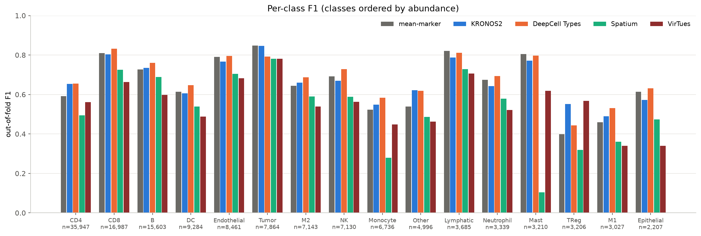
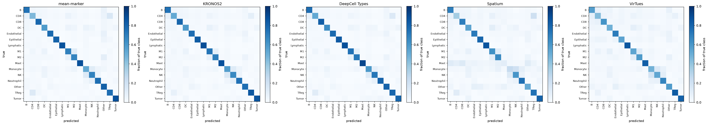
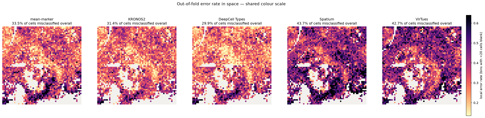

# Results

Three spatial-proteomics foundation models on one classical Hodgkin lymphoma
CODEX region: **138,825 expert-labelled cells**, 16 cell types, an 18-marker
panel, four spatial quadrant folds with a 64 px guard band, and one identical
linear probe. Protocol and how to reproduce: [CLAUDE.md](CLAUDE.md).

A **mean-marker** readout — the average intensity of each panel marker over the
cell's own pixels — is scored alongside as the control. It is the thing a
conventional pipeline already does, with no model and no GPU.

> **VirTues is in the harness but not in these numbers.** It was added after this
> run ([src/run_virtues.py](src/run_virtues.py)) and has not been scored yet, so
> every table below is the original three plus the control. `./run_all.sh virtues`
> then `./run_all.sh evaluate` fills in the fourth row — the probe cache means
> only VirTues gets re-probed.

---

## Headline

**Two of the three foundation models beat the no-model control, and not by much.
One lands well below it.**

| Encoder | Macro F1 | Balanced acc | Avg precision | ROC AUC | Δ F1 vs control |
| --- | ---: | ---: | ---: | ---: | ---: |
| **DeepCell Types** | **0.680** ± 0.020 | 0.736 | 0.769 | 0.974 | **+0.028** |
| **KRONOS2** | 0.662 ± 0.014 | 0.725 | 0.743 | 0.971 | +0.010 |
| *mean-marker (control)* | *0.652* ± 0.019 | *0.705* | *0.721* | *0.963* | — |
| **Spatium** | 0.516 ± 0.005 | 0.583 | 0.552 | 0.932 | −0.136 |



Mean ± standard deviation across the four spatial folds. Every encoder saw the
same cells, the same folds, the same 2,000-cells-per-class training budget and
the same Optuna search over `C` — so these differences are differences in
*representation*, not in protocol.

**Read the delta, not the absolute numbers.** Mean-marker is a strong baseline
on a well-designed antibody panel: the 18 markers were *chosen* by the assay
designers to separate exactly these cell types, so a foundation model has little
headroom to add. A +0.028 F1 gain over "just average the pixels" is a real but
modest return for a 20-minute GPU pass over 152,815 cells.

---

## The two tables measure different things

This is the single most important caveat in this repo, so it gets its own
section.

**Linear probe** freezes the encoder and fits logistic regression on top. Every
model gets identical supervision, so the ranking is a ranking of
*representations*.

**Native mode** is how each model is actually meant to be used — DeepCell Types
predicts zero-shot from its own vocabulary, Spatium fine-tunes a prototype head
on a few labelled cells. The supervision differs between rows, so this ranks
*deployments*, not representations.

| Model | Mode | Macro F1 | Balanced acc |
| --- | --- | ---: | ---: |
| DeepCell Types | zero-shot | 0.223 | 0.272 |
| Spatium | 10-shot | 0.408 | 0.474 |
| Spatium | 20-shot | 0.467 | 0.535 |
| Spatium | 100-shot | 0.501 | 0.569 |

Average precision and ROC AUC are `NaN` by design: neither model emits
calibrated probabilities over the 16 benchmark classes, and computing those
metrics off hard labels would flatter them.

**DeepCell Types scores 0.680 as a representation and 0.223 as a zero-shot
predictor.** Those are not in tension — they are measuring different failures.
The backbone separates these cells well; what breaks is mapping its fixed
pan-tissue vocabulary onto this dataset's label space.

**Spatium's few-shot curve is well behaved** — 0.408 → 0.467 → 0.501 as the
support set grows 10× — and at 100 shots it essentially reaches its own frozen
linear-probe ceiling of 0.516. The fine-tuning is working; the representation is
the limit.

---

## Why DeepCell Types fails zero-shot here

Its predicted class distribution against ground truth, before any scoring:

| Class | Ground truth | Predicted |
| --- | ---: | ---: |
| CD4 | 37,480 | **4,084** |
| TReg | 3,352 | **24,119** |
| B | 16,196 | 30,468 |
| Neutrophil | 3,442 | **16,062** |
| CD8 | 17,184 | 15,692 ✓ |
| NK | 7,339 | 7,098 ✓ |
| Tumor | 8,260 | 10,548 |
| M1 + M2 | 10,387 | *(28,484 as undivided `Macrophage`)* |
| Monocyte | 6,913 | **0** |
| Other | 5,108 | **18** |

Three distinct problems, only one of which is a modelling failure:

1. **It collapses CD4 into TReg** — a 7× over-call of a rare class against a 9×
   under-call of the most abundant one. This is the dominant error and it is a
   genuine perception/calibration failure.
2. **`Other` and `Monocyte` are effectively unreachable.** Its vocabulary has no
   equivalent of this dataset's catch-all class, and it never once predicts
   Monocyte. A class you cannot name is a class you cannot score on.
3. **20.5% of its calls cannot be expressed in the 16-class space at all** —
   28,484 `Macrophage` (the benchmark splits M1/M2 by polarisation; DeepCell
   Types has one undivided class) plus 2,797 generic `Tcell`.

**I expected (3) to explain much of the gap. It does not.** Rescoring every
model with M1+M2 merged into a single `Macrophage` class moves DeepCell Types'
zero-shot F1 from 0.223 to only **0.238**:

| Model | 16 classes | Collapsed (M1+M2 → Macrophage) |
| --- | ---: | ---: |
| DeepCell Types [probe] | 0.680 | 0.699 |
| KRONOS2 [probe] | 0.662 | 0.683 |
| mean-marker [probe] | 0.652 | 0.673 |
| Spatium [probe] | 0.516 | 0.538 |
| DeepCell Types (zero-shot) | 0.223 | **0.238** |
| Spatium (100-shot) | 0.501 | 0.510 |

So the vocabulary-granularity artifact costs it ~1.5 F1 points, not the ~45 that
separate its zero-shot score from its probe score. The CD4→TReg collapse is the
real story.

> The collapse is applied post hoc to the same predictions, not by retraining on
> a coarser label set. A probe *trained* on merged labels might do slightly
> better, so these are conservative.

---

## Marker vocabulary decides what each model can see

Before any model ran, resolving the panel against each model's vocabulary
already predicted where they would fail.

| Panel marker | KRONOS2 | DeepCell Types | Spatium |
| --- | --- | --- | --- |
| `dapi` | ✅ | ✅ as `dsDNA` | ❌ not a protein |
| `mct` (mast cell tryptase) | ✅ | ✅ as `Tryptase` | ❌ **no tryptase entry** |
| `cd30` | ✅ | ❌ **no CD30 entry** | ✅ |
| other 15 | ✅ | ✅ | ✅ |
| **markers seen** | **18/18** | **17/18** | **16/18** |

KRONOS2 is marker-agnostic by design — it encodes whatever channels the patch
carries — so it is the only model that sees the whole panel.

**Spatium's missing tryptase is directly visible in the results.** Mast cells are
its single worst class by a wide margin:

| Class | mean-marker | KRONOS2 | DeepCell Types | Spatium |
| --- | ---: | ---: | ---: | ---: |
| **Mast** | 0.805 | 0.772 | 0.798 | **0.104** |
| Monocyte | 0.523 | 0.549 | 0.583 | 0.279 |

It is not that Spatium is bad at mast cells — it cannot see the marker that
defines them. Every other model scores ~0.8 on the same cells.

**DeepCell Types ran on 17 of 18 markers, missing CD30** — the marker that
defines the Hodgkin Reed–Sternberg tumour class in this dataset. Its own library
says so: *"1 of 18 input channels were masked out; prediction uses the remaining
17 marker(s). Masked: cd30 (not in the marker registry)."* Despite that it
reaches 0.792 F1 on Tumor via the probe, so it is calling Reed–Sternberg cells on
morphology and the other 17 channels.

---

## Per-class results



| Class | n cells | mean-marker | KRONOS2 | DeepCell Types | Spatium |
| --- | ---: | ---: | ---: | ---: | ---: |
| CD4 | 35,947 | 0.592 | 0.653 | **0.655** | 0.494 |
| CD8 | 16,987 | 0.810 | 0.803 | **0.832** | 0.725 |
| B | 15,603 | 0.727 | 0.735 | **0.760** | 0.689 |
| DC | 9,284 | 0.614 | 0.606 | **0.648** | 0.539 |
| Endothelial | 8,461 | 0.790 | 0.766 | **0.796** | 0.704 |
| Tumor | 7,864 | **0.849** | 0.847 | 0.792 | 0.781 |
| M2 | 7,143 | 0.644 | 0.660 | **0.687** | 0.590 |
| NK | 7,130 | 0.691 | 0.669 | **0.728** | 0.588 |
| Monocyte | 6,736 | 0.523 | 0.549 | **0.583** | 0.279 |
| Other | 4,996 | 0.538 | **0.622** | 0.618 | 0.487 |
| Lymphatic | 3,685 | **0.821** | 0.787 | 0.812 | 0.729 |
| Neutrophil | 3,339 | 0.674 | 0.642 | **0.694** | 0.579 |
| Mast | 3,210 | **0.805** | 0.772 | 0.798 | 0.104 |
| TReg | 3,206 | 0.399 | **0.552** | 0.443 | 0.319 |
| M1 | 3,027 | 0.460 | 0.489 | **0.531** | 0.360 |
| Epithelial | 2,207 | 0.613 | 0.572 | **0.632** | 0.473 |

### Where the vision models earn their keep

**KRONOS2's biggest win is TReg: 0.552 vs 0.399 for mean-marker (+38%)** — its
largest margin over the control on any class, and it beats DeepCell Types there
too (0.443).

This is the result that most justifies a vision encoder. TReg is separated from
CD4 by FOXP3, and FOXP3 is a *nuclear* transcription factor: what distinguishes a
TReg is not how much FOXP3 signal a cell has but **where in the cell it sits**.
Averaging intensity over the cell mask destroys exactly that information. A model
that reads pixels can recover it; a model that reads a mean cannot.

KRONOS2 also leads on `Other` (0.622 vs 0.538), the catch-all class with no
consistent marker signature — again a case where morphology carries information
that intensity does not.

Conversely, mean-marker wins outright on **Tumor** (0.849), **Lymphatic** (0.821)
and **Mast** (0.805) — all classes defined by a single bright, unambiguous marker
(CD30, podoplanin, tryptase). When one channel answers the question, averaging it
is not just sufficient, it is optimal.

---

## Confusion structure



Row-normalised, so each row shows where the cells of that true class actually
went. All four have strong diagonals; the informative part is the off-diagonal
mass.

- **CD4 → B leakage** appears in every model, including the control — the largest
  single confusion in the benchmark.
- **CD4 ↔ TReg** is the second, and is where KRONOS2 separates itself.
- **Spatium's Mast row has almost no diagonal mass**, spreading instead across
  unrelated classes — the visual signature of a missing defining marker.
- **M1 ↔ M2** confusion is present in all four, consistent with polarisation
  being the hardest distinction in the panel (M1 is the weakest class for every
  model: 0.360–0.531).

---

## Errors in space



Local out-of-fold error rate per spatial bin, on a shared colour scale. Binned
rather than a per-cell scatter on purpose: at 139k cells and a ~30% error rate, a
scatter overplots the correct cells entirely and reads as near-total failure
whichever model you look at. A rate per bin is immune to that and is the quantity
the question is actually about.

**Errors are not uniformly scattered.** All four encoders — including the
no-model control — share the same spatial structure:

- a **low-error region** through the upper-middle and right of the section, where
  even mean-marker drops to ~15–20% error;
- a **persistent high-error band along the lower and lower-left margin**, dark in
  every panel, reaching 50–65% error.

That the *same* regions are hard for a pixel model (KRONOS2), a
language-informed pixel model (DeepCell Types), an expression model (Spatium) and
a plain intensity average is the informative part. Correlating the per-bin error
rates pairwise makes it a measurement rather than an impression:

| | KRONOS2 | DeepCell Types | Spatium |
| --- | ---: | ---: | ---: |
| **mean-marker** | 0.727 | 0.775 | 0.706 |
| **KRONOS2** | — | 0.732 | 0.615 |
| **DeepCell Types** | — | — | 0.649 |

Pearson *r* between per-bin error rates, 0.62–0.78 across every pair. If this
were a model weakness it would not reproduce that strongly across four encoders
with three different input modalities — one of which never sees a pixel. It
points instead at something in the tissue or the ground truth there: a denser,
more mixed compartment where cells are genuinely ambiguous, or where annotation
is least certain.

Overall error rates: DeepCell Types 29.9%, KRONOS2 31.4%, mean-marker 33.5%,
Spatium 43.7%.

Spatium is uniformly darker rather than differently shaped: it fails in the same
places, just more.

The four quadrants are genuinely different tissue — Q3 is M2/Tumor/`Other`-rich,
Q1 is CD8-rich — yet fold-to-fold standard deviations stay small (0.005–0.020
F1). So the difficulty is local and shared, not a fold-level domain shift, which
is what makes the mean across folds worth quoting.

---

## What this does and does not establish

**Does:**
- On this slide, with this panel, DeepCell Types has the strongest frozen
  representation, KRONOS2 is second, and both beat a no-model baseline — modestly.
- Spatium's representation is substantially weaker than mean intensity here, and
  at least part of that is a vocabulary gap rather than a modelling failure.
- Marker-vocabulary coverage is not a detail. It predicted the largest per-class
  failure in the study before any model ran.

**Does not:**
- **One slide, one tissue, one platform.** cHL lymph node on CODEX. Nothing here
  generalises to other tissues, panels, or platforms without re-testing.
- **The panel favours the baseline.** These 18 markers were chosen to separate
  these 16 types. On a panel with novel or poorly-chosen markers — where a
  foundation model's pretraining should matter most — the gap could look very
  different.
- **Spatium is at a structural disadvantage on a vision benchmark.** It reads
  only per-cell expression, never pixels, so it cannot use morphology or
  subcellular localisation at all. It is also the only model whose metadata
  vocabulary could not describe this dataset (`Disease_type` padded to `PAD` —
  no lymphoma entry), and it sees the fewest markers (16/18).
- **Zero-shot DeepCell Types is being scored against a label space it was never
  told about,** via a mapping ([src/common/dct_class_map.yaml](src/common/dct_class_map.yaml))
  that is a defensible judgement call, not ground truth.

### Fair-comparison caveats worth stating

- KRONOS2's embeddings are bit-exact to its published gold standard only on the
  pinned stack (torch 2.6.0+cu124, batch 16) — reproduced here.
- The probe protocol is CORAL's published cell-phenotyping benchmark, adopted
  wholesale so these numbers sit on the same footing as the published ones.
- Spatium's few-shot arm uses its own model, losses and dataset classes; only the
  data plumbing and trainer are local, because the shipped script hardcodes the
  authors' paths, a W&B logger and multi-GPU DDP.

---

## Reproducing

```bash
source env/secrets.env
GPU_JOBID=<a gpuq job> ./run_all.sh      # or unset, to sbatch each stage
```

Wall-clock on one A30: prep ~13 min, KRONOS2 extraction 19 min, DeepCell Types
~4 min, Spatium ~10 min. The linear probes are the long pole at roughly 1–2 h per
encoder on 16 CPU cores — 15 Optuna trials × 4 folds of multinomial logistic
regression on up to 32k × 768. Probe results are cached per encoder, so adding a
fifth encoder re-probes only that one.

Raw numbers: [results/probe_per_fold.csv](results/probe_per_fold.csv) ·
[results/direct_prediction.csv](results/direct_prediction.csv) ·
[results/collapsed_label_space.csv](results/collapsed_label_space.csv) ·
[results/per_class_f1.csv](results/per_class_f1.csv) ·
[results/spatium_fewshot.csv](results/spatium_fewshot.csv)
